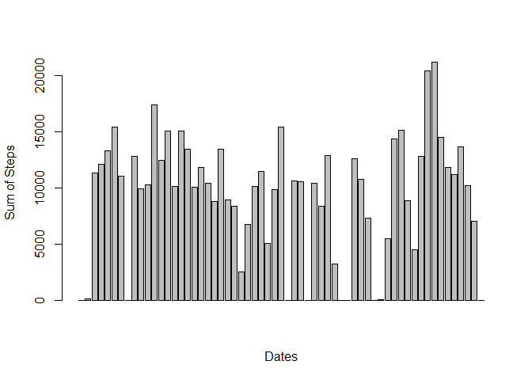
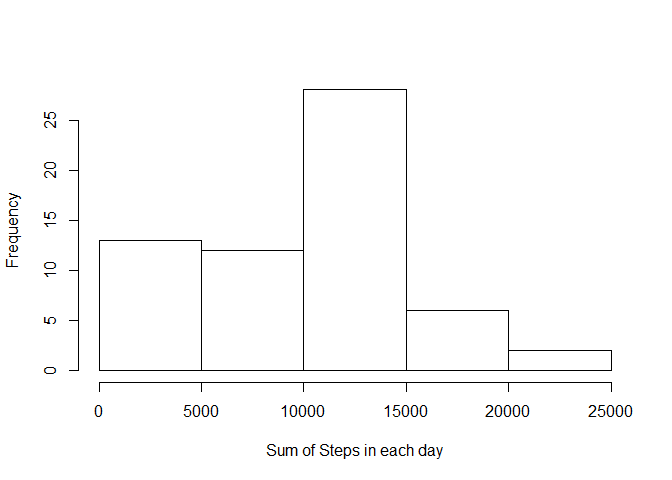
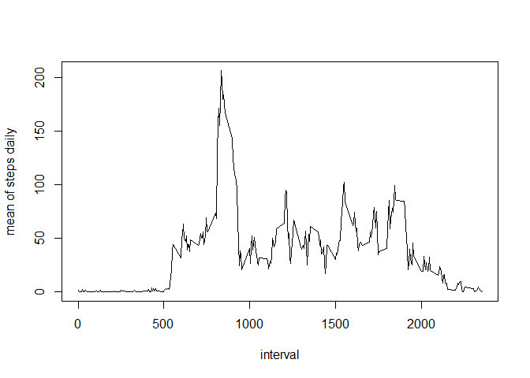
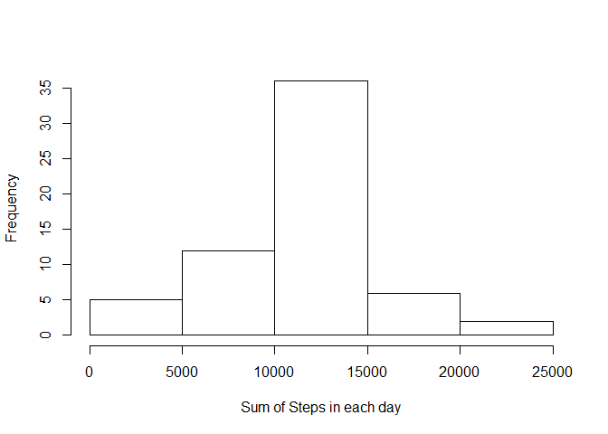
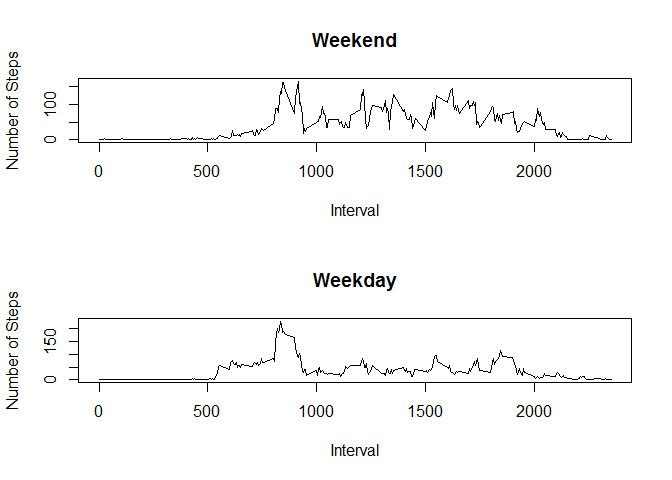

# Reproducible Research: Peer Assessment 1


## Loading and preprocessing the data

```r
rawData <- read.csv("activity.csv")
aggdata <- aggregate(rawData$steps, by=list(rawData$date), 
                    FUN=sum, na.rm=TRUE)
names(aggdata) <- c("days", "tspd")
meansteps <- aggregate(rawData$steps, by=list(rawData$interval), 
                    FUN=mean, na.rm=TRUE)
names(meansteps) <- c("interval", "meanstep")
```


## What is mean total number of steps taken per day?  
The sum of steps in each day:

```r
barplot(aggdata$tspd, xlab = "Dates", ylab = "Sum of Steps")
```

 

Histogram of the total number of steps taken each day:  

```r
hist(aggdata$tspd, xlab = "Sum of Steps in each day", ylab = "Frequency", main = NULL)
```

 

Mean of the total number of steps taken each day:  

```r
mean(aggdata$tspd)
```

```
## [1] 9354
```

Median of the total number of steps taken each day:  

```r
median(aggdata$tspd)
```

```
## [1] 10395
```

## What is the average daily activity pattern?
Average daily activity pattern:

```r
plot(meansteps$interval, meansteps$meanstep, type="l", xlab = "interval", ylab = "mean of steps daily", main = NULL)
```

 

The interval has the MAX steps:

```r
meansteps[meansteps$meanstep == max(meansteps$meanstep), 1]
```

```
## [1] 835
```

## Imputing missing values
Number of NAs in Data:

```r
sum(is.na(rawData$steps))
```

```
## [1] 2304
```
Replace NAs with the mean steps on THAT interval:

```r
newData <- rawData
repList <- which(is.na(rawData))
for(index in repList){
   newData[index, 1] <- meansteps[meansteps$interval == rawData[index, 3], 2] 
}
```
Histogram of the total number of steps taken each day from NewData:

```r
newAggdata <- aggregate(newData$steps, by=list(rawData$date), 
                    FUN=sum, na.rm=TRUE)
names(newAggdata) <- c("days", "tspd")
hist(newAggdata$tspd, xlab = "Sum of Steps in each day", ylab = "Frequency", main = NULL)
```

 

Mean of the total number of steps taken each day From NewData:  

```r
mean(newAggdata$tspd)
```

```
## [1] 10766
```

Median of the total number of steps taken each day from NewData:  

```r
median(newAggdata$tspd)
```

```
## [1] 10766
```
Now the mean steps of each interval is approaching to a normal distribution.  

## Are there differences in activity patterns between weekdays and weekends?
Create a new variable to indicate if the date is weekday:

```r
newData$day <- weekdays(as.Date(newData$date))
i <- 1
for(d in newData$day){
    if((d == "Saturday") | (d == "Sunday")){
        newData[i,4] <- "weekend"
    }
    else{
        newData[i,4] <- "weekday"
    }
    i <- i + 1
}
newData$day <- as.factor(newData$day)
```

A panel plot to indicate the differences in activity patterns between weekdays and weekends:

```r
wkdata <- aggregate(newData$steps, by=list(newData$day, newData$interval), FUN=mean, na.rm=TRUE)
names(wkdata) <- c("days", "interval", "steps")

par(mfrow = c(2,1)) 
plot(unique(newData$interval), wkdata[wkdata$days == "weekend", ]$steps, type = "l", xlab = "Interval", ylab = "Number of Steps", main = "Weekend")
plot(unique(newData$interval), wkdata[wkdata$days == "weekday", ]$steps, type = "l", xlab = "Interval", ylab = "Number of Steps", main = "Weekday")
```

 


